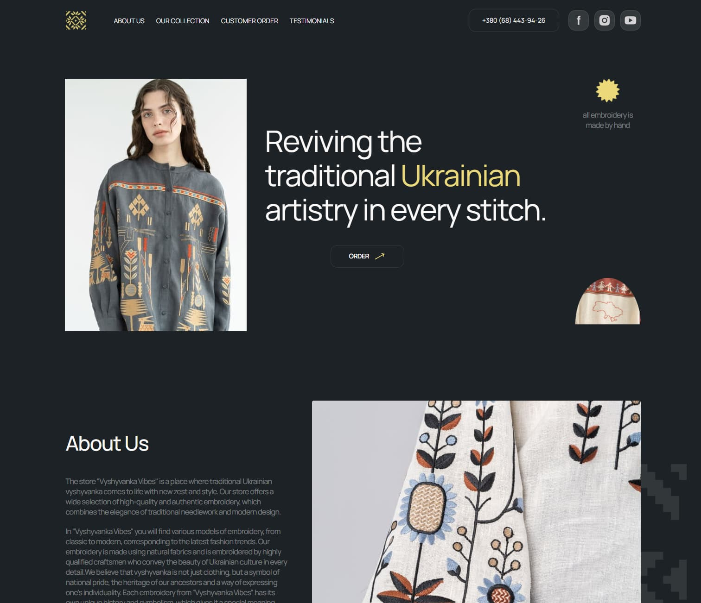

# Vyshyvanka Vibes - Ukrainian Embroidery Website

**English** | **[🇺🇦 Українською](README_uk.md)**

---

Modern, responsive landing page for a Ukrainian embroidery brand. A collection
of traditional clothing that combines folk symbolism and modern style.

## 🎯 Project Purpose

This project was created as part of an educational team collaboration focusing
on:

- teamwork using Git/GitHub
- perfect rendering on any device (mobile-first)
- writing semantic, clean, and maintainable code

## 🔍 Preview



### 🔗 Links

- **Live version:** https://aleksandr-reznichenko.github.io/vyshyvanka-vibes
- **Repository:** https://github.com/Aleksandr-Reznichenko/vyshyvanka-vibes

## 🧩 Key Features

- Responsive layout (mobile / tablet / desktop)
- Mobile-first approach
- Clear HTML document structure
- Organized style system with division into base, sectional, and helper files
- Media queries for various breakpoints
- Responsive images (different sizes for different devices)
- SVG sprite for icons
- Mobile menu with open/close functionality
- Smooth scroll to sections

## 🛠️ Technologies

- HTML5
- CSS3
- Flexbox
- Vite
- Git / GitHub
- Figma (design-to-code workflow)

## 📁 Project Structure

`src/`  
 ├─ `css/` - styles separated by section logic  
 ├─ `js/` - interactive behavior  
 ├─ `img/` - optimized images and SVG  
 └─ `index.html` - main page structure

The structure allows for independent work on sections and project scaling
without chaos in the styles.

## 🚀 Run Locally

```bash
npm install
npm run dev
```
